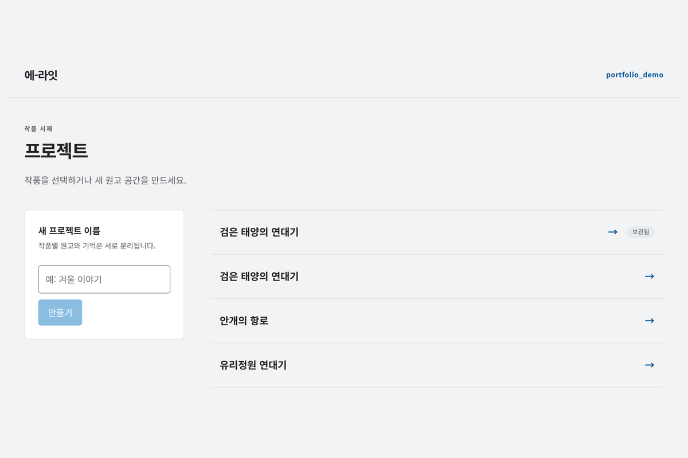
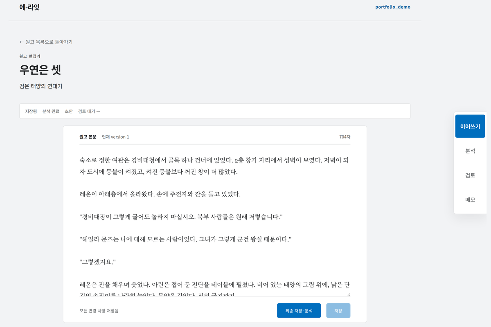
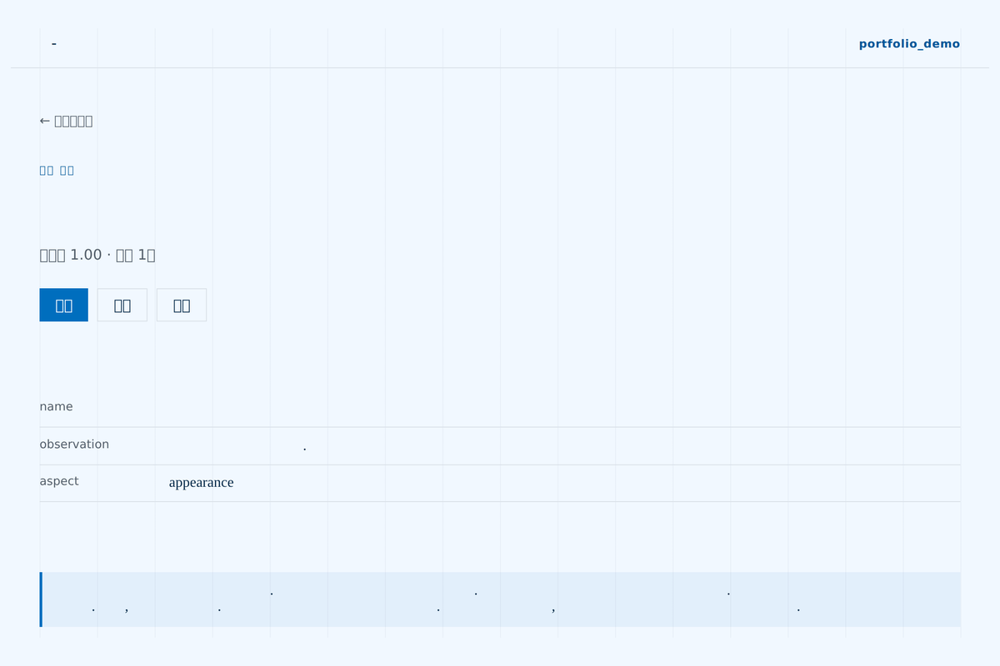
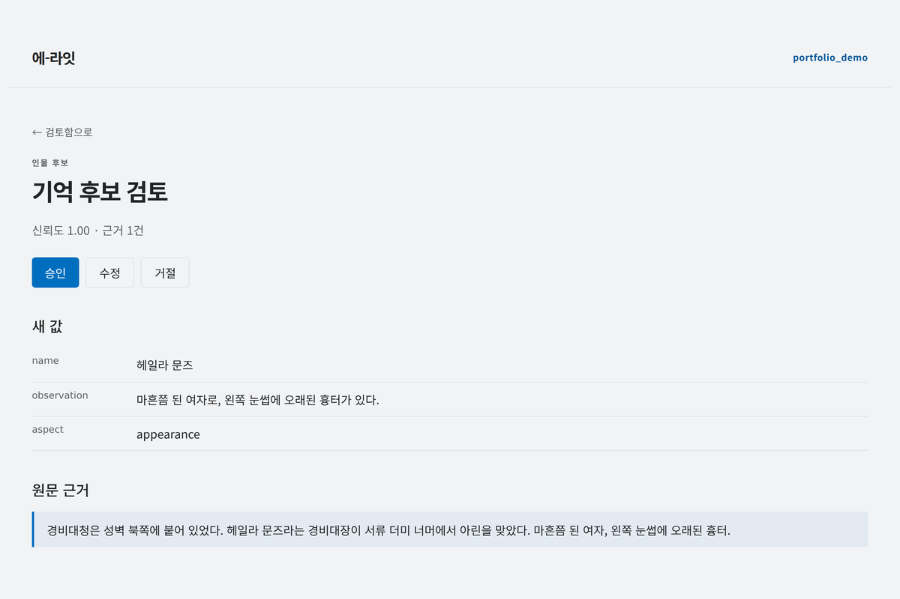

# 에-라잇

개인 창작자를 위한 **글쓰기 운영체제** — 사용자의 원고·설정·세계관·문체·분석 결과를 장기 기억으로
축적하고, 글쓰기 시점마다 필요한 기억만 검색해 제공하는 시스템이다. 단순 "AI 글쓰기 챗봇"이 아니라,
**MongoDB 정본(SOT) + Narrative Memory + Agentic Search**를 결합해 일관성 있는 장편 창작을 돕는 것을
목표로 한다.

모든 AI 출력(생성·분석)은 곧바로 정본이 되지 않고 **candidate**로 남아, Gate와 검토·결정적 승격을
거쳐 기억으로 반영된다.

작업 흐름 — 프로젝트 → 원고 작업공간 → 기억 후보 검토(클릭하면 원본 크기):

| 프로젝트 목록 | 원고 작업공간 |
|---|---|
| [](docs/img/프로젝트목록_3x2.png) | [](docs/img/글편집페이지_3x2.png) |

| 기억 후보 목록 | 기억 후보 검토 |
|---|---|
| [](docs/img/기억후보목록_3x2.png) | [](docs/img/기억후보검토_3x2.png) |

<sub>스크린샷은 창 크기가 제각각이라 같은 규칙(배경색 패딩 3:2 · 1200px)으로 정규했다 —
[`docs/img/normalize.py`](docs/img/normalize.py). 로그인 화면 포함 5장이 `docs/img/`에 있다.</sub>

## 이 저장소를 읽는 세 축

같은 시스템을 **기획 · 개발 · 서비스** 세 관점에서 문서로 남겼다. 어느 쪽이 궁금한지에 따라
들어가는 문이 다르다.

| 축 | 답하는 질문 | 시작점 |
|---|---|---|
| **[기획](#기획--무엇을-왜-만드는가)** | 무엇을 왜 만드는가. 어디까지가 MVP인가 | [`docs/product-overview.md`](docs/product-overview.md) · [`docs/observability-kpi-rationale.md`](docs/observability-kpi-rationale.md) |
| **[개발](#개발--어떻게-만들어졌는가-설계-결정과-검증)** | 결정을 어떻게 내리고 어떻게 검증하는가 | [`docs/system-contract-sot.md`](docs/system-contract-sot.md) · [`docs/plans/README.md`](docs/plans/README.md) |
| **[서비스](#서비스--어떻게-돌리고-지켜보는가)** | 어떻게 띄우고, 무엇을 보고, 어떻게 고치는가 | [`HANDOFF.md`](HANDOFF.md) · [`docs/runbooks/local-llama-server.md`](docs/runbooks/local-llama-server.md) |

> **채용·평가 목적으로 왔다면 [`docs/portfolio.md`](docs/portfolio.md)부터** — 시간 예산별(5분·30분·2시간)
> 읽기 경로, 대표 사례 해설, 증거 지도가 있다.

---

## 기획 — 무엇을, 왜 만드는가

### 풀려는 문제

장편 창작에서 무너지는 것은 문장력이 아니라 **일관성**이다. 인물의 말투가 3장과 17장에서 다르고,
20장 전에 죽은 인물이 되살아나고, 작가 자신도 "그때 그 설정이 뭐였더라"를 못 찾는다. 범용 챗봇은
대화창을 벗어나면 아무것도 기억하지 못하므로 이 문제를 구조적으로 풀 수 없다.

그래서 이 시스템의 중심은 생성 모델이 아니라 **기억**이다. 원고·설정·세계관·문체를 장기 기억으로
축적하고, 글을 쓰는 시점마다 **필요한 조각만 검색해** 모델에 준다.

### 제품 원칙 (기획 단계에서 못박은 것)

- **AI 출력은 정본이 아니다.** 생성·분석 결과는 전부 **candidate**로 남고, Gate 판정과 사람의
  검토를 거쳐야 기억이 된다. "AI가 쓴 것이 곧 사실"이 되는 순간 기억이 오염되기 때문이다.
- **기억은 append-only.** 덮어쓰지 않고 버전을 쌓는다. 잘못된 갱신이 과거를 지우지 못한다.
- **모든 주장에는 근거 포인터가 붙는다**(`source_ref`). "어디서 나온 설정인가"를 원문 위치까지
  되짚을 수 있어야 작가가 AI의 판단을 검증할 수 있다.

**제품 컨셉·MVP 범위·핵심 위험을 한 자리에서 보려면
[`docs/product-overview.md`](docs/product-overview.md)** — *무엇을, 누구를 위해, 어디까지*를
**현재 상태 기준**으로 정리한 한 장 요약이다. 원안에서 달라진 지점(단일 사용자 → 다중 사용자,
추출 5종 → 3종 등)을 따로 모아 뒀다.

전체 구상과 대안 검토는 [`docs/abstract.md`](docs/abstract.md)에 있다 —
**§1 핵심 제품 컨셉** · **§2 핵심 설계 원칙** · **§15 MVP 범위 제안** · **§16 핵심 위험과 대응**.
다만 이것은 **2026-06 초안**이라 현재 상태와 다른 곳이 있다(위 한 장 요약 §5).
확정된 제품 경계·불변 원칙은 [`docs/plans/00-foundations.md`](docs/plans/00-foundations.md)로 내려왔다.

### 무엇을 먼저 만드는가 (Phase ↔ MVP)

기술 의존성 순서(Phase)와 사용자에게 전달되는 가치 묶음(MVP)은 **1:1이 아니다.** 그 매핑을
[`docs/plans/README.md`](docs/plans/README.md#phase와-mvp의-관계)에 표로 유지한다. 제품화에 필요하지만
당장 급하지 않은 것들은 **트리거가 왔을 때 하나씩 여는 백로그**로 분리했다 —
[`docs/plans/product-readiness-backlog.md`](docs/plans/product-readiness-backlog.md).

### 운영 KPI 기획

> **"지금 이 AI가 제대로 일하고 있는가?"** — LLM 파이프라인은 블랙박스라, 계측이 없으면 운영자는
> **감으로** 프롬프트를 바꾸고 모델을 교체한다.

[`docs/observability-kpi-rationale.md`](docs/observability-kpi-rationale.md)는 **어떤 운영 질문에
답하기 위해 이 지표를 잡았고, 이 숫자로 어떤 의사결정을 내리는가**를 정리한 문서다. 코드 구조가
아니라 기획 관점이며, 이 저장소에서 **제품/운영 기획 사고를 가장 직접적으로 보여주는 문서**다.

- 지표를 새로 만들지 않고 **이미 있는 판단 AI(Gate)의 결정을 정량 점수로 재활용**했다.
- 그 점수의 **한계를 함께 적었다** — Gate는 가장 심각한 지적 하나로 결정하므로 지적의 개수·조합은
  버려진다. 의도된 단순화임을 명시하고 정밀화 경로를 로드맵으로 남겼다.

---

## 개발 — 어떻게 만들어졌는가 (설계 결정과 검증)

이 저장소에서 **문서는 코드의 부산물이 아니라 선행 조건**이다. 아키텍처·계약 리터럴·정책처럼
"조용히 고르면 나중에 되돌릴 수 없는" 선택은 코드를 쓰기 전에 **결정 브리프**로 올리고,
구현 뒤에는 **다른 세션의 검증자가 반증을 시도**한다. 규칙 자체는 [`CLAUDE.md`](CLAUDE.md)에 있다.

```
결정 브리프 → 오너 결정 → 구현 + 양방향 회귀 가드 → 독립 검증(반증 시도) → 정본(SoT) 개정
```

| 단계 | 산출물 | 규모 |
|---|---|---|
| **① 결정 브리프** — 선택지 표(`선택지·설명·장점·단점`) + 구현자 추천 + 유예 항목을 적고 **멈춘다**. 추측 구현 금지 | [`docs/plans/`](docs/plans/README.md) | **96개** |
| **② 구현 + 회귀 가드** — 가드는 **양방향**이어야 한다: 원래 결함을 재현하면 실패(under-strict), 과잉 교정으로 정상 경로를 깨도 실패(over-strict) | `tests/` | **2,316 passed / 2,654 subtests** |
| **③ 독립 검증** — 구현자가 아닌 세션이 **뮤테이션**(고친 것을 되돌려 회귀가 다시 실패하는지)으로 반증을 시도한다 | [`docs/verifications/`](docs/verifications/README.md) | **265건 / 61일치** |
| **④ 정본 개정** — 계약이 바뀌면 SoT 버전을 올리고 **변경 이유와 근거 링크**를 남긴다 | [`docs/system-contract-sot.md`](docs/system-contract-sot.md) | **v1.8.13**, 변경이력 전량 보존 |
| **⑤ 인수인계** — 다음 작업자가 시간을 잃지 않도록 **함정**을 기록한다 | [`HANDOFF.md`](HANDOFF.md) · [`docs/daily_logs/`](docs/daily_logs/) | 일자별 |

**검증 판정 분포는 합격 185 · 조건부 합격 77 · 불합격 3**다. **조건부 합격이 29%**라는 것이
이 절차가 형식적 통과가 아니라는 증거이며, 각 지적은 후속 커밋에서 닫힌다.

### 평가자를 위한 짧은 경로

전부 읽을 필요는 없다. 이 셋이면 작업 방식이 드러난다.

1. **결정이 어떻게 내려지는가** — [`docs/plans/auth-d8-7-infra-auth-decisions.md`](docs/plans/auth-d8-7-infra-auth-decisions.md)
   저장소 무인증 노출을 **자격증명으로 막을지, 노출면을 없앨지**를 4지선다로 올린 브리프.
   `mongod --auth --replSet`이 keyfile을 강제한다는 **직접 실측**이 추천을 바꿨다.
2. **검증이 무엇을 잡는가** — [`docs/verifications/2026-08-02/d8_7_g1c_loopback_exposure.md`](docs/verifications/2026-08-02/d8_7_g1c_loopback_exposure.md)
   위 결정의 구현을 검증한 기록. **"시행 완료"가 compose 파일 수준에서만 참이고 런타임에서는
   거짓**이었음을 `docker ps`로 잡아냈다.
3. **함정이 어떻게 축적되는가** — [`HANDOFF.md`](HANDOFF.md)의 "함정" 절.
   `pymongo`가 naive datetime을 돌려줘 **유닛 46건이 전부 통과하는데 배포만 깨진** 사례처럼,
   테스트로는 안 보이는 것들이 재발 방지 형태로 적혀 있다.

---

## 서비스 — 어떻게 돌리고, 지켜보는가

**현재 단계는 로컬 1인 운영(dogfood 직전)이다.** 아래는 그 단계에서 실제로 하고 있는 것이며,
"나중에 하겠다"는 계획이 아니라 돌아가는 절차다.

### 구성

| 서비스 | 역할 |
|---|---|
| **LLM Gateway** | llama.cpp·OpenAI 호환 provider(llama.cpp 서버·구글 등) 앞단. 실패 taxonomy·창 가드·**키 회전·모델 폴백**을 여기서 통제 |
| **Core SOT** | MongoDB 정본 — project/draft/version/snapshot/source reference |
| **Analysis / Memory** | 구조화 기억 후보 추출 → 대조 → append-only canonical memory |
| **Indexing** | ChromaDB(vector) · Elasticsearch(nori lexical) 파생 인덱스 + async outbox 워커 |
| **Context Search** | 정본 재조회 기반의 검증된 ContextPackage |
| **Agent loop / Gate** | bounded flat loop, 출력 품질 통제 |
| **Frontend** | React + TS SPA(nginx). 원고 작업공간 · Review Inbox · 관측 대시보드 |

전 구성요소가 `docker compose up` 하나로 뜬다. **포트는 전용 대역으로 repo에 고정**돼 있어
어느 머신에서든 같은 번호로 뜬다([`.env.example`](.env.example)에 값과 근거).

### 임베딩 모델을 바꾸면 색인을 다시 만들어야 한다

**검색 구조를 모르고 모델만 바꾸면 조용히 나빠진다.** 그래서 규칙을 먼저 적는다 —
**임베딩 모델을 바꾸면 반드시 재색인한다.** *"차원이 바뀌면"* 이 아니라 **"모델이 바뀌면"** 이다.

**왜 그런가.** 기억 검색은 글을 임베딩 모델로 **벡터(숫자 목록)** 로 바꿔 Chroma에 저장해 두고,
질문이 들어오면 그 질문도 **같은 모델로** 벡터로 바꿔 가까운 것을 찾는 방식이다. 모델이 다르면
같은 문장이라도 다른 좌표에 찍힌다 — **다른 지도의 좌표끼리 거리를 재는 셈**이라 "가깝다"가
의미를 잃는다. 저장된 벡터와 질의 벡터는 **같은 모델이 만든 것이어야만** 비교가 성립한다.

**실패하는 방식이 둘인데, 위험한 쪽은 조용한 쪽이다.**

| 바꾼 것 | 무슨 일이 일어나는가 |
|---|---|
| **차원이 다른 모델** (1024 → 다른 값) | **첫 임베딩 호출에서 멈춘다.** 차원 가드가 응답 벡터의 길이를 보고 `EmbeddingProviderError`로 fail-fast 한다([`indexing/embedding.py`](services/application/app/indexing/embedding.py)). 시끄럽게 실패하므로 놓칠 일이 없다 |
| **차원이 같은 다른 모델** (1024 → 다른 1024 모델) | **아무 일도 안 일어난다.** 가드가 통과하고, 검색은 계속 결과를 낸다. 옛 벡터와 새 질의가 한 공간인 척 섞이면서 **품질만 조용히 떨어진다** — 에러도 경고도 없다 |

두 번째 칸이 이 절이 존재하는 이유다. 색인 구조를 아는 사람에게는 재색인이 당연한 수순이지만,
**시스템은 그것을 잊었다고 알려 주지 않는다.**

**절차.** 모델을 바꿀 때는 셋을 한 묶음으로 한다.

1. 임베딩 모델을 바꾼다 — 로컬이면 `EMBEDDING_MODEL_NAME`(기본 `dragonkue/BGE-m3-ko`),
   외부 API면 `EMBEDDING_API_MODEL`(아래 절). 차원이 다르면 `EMBEDDING_DIMENSIONS`(기본
   `1024`)도 함께 바꾼다 — **하나만 바꾸면 위 표의 첫 칸에서 멈춘다.**
2. 스택을 다시 띄운다(`docker compose up -d`). 로컬 모델이면 임베딩 서비스가 새 모델을 받는다.
3. **프로젝트마다** 재색인 스크립트 둘을 돌린다. 정본 기억과 검토 대기 candidate는 색인이 따로다.

```bash
python3 scripts/phase2b5_reindex_memory.py    --project-id <PROJECT_ID> --mongo-uri "$CORE_SOT_MONGO_URI"
python3 scripts/phase2b5_reindex_candidate.py --project-id <PROJECT_ID> --mongo-uri "$CORE_SOT_MONGO_URI"
```

> **★ 함정: `CHROMA_HOST`·`ELASTICSEARCH_URL`이 없으면 두 스크립트는 in-memory 가짜 색인에 쓴다.**
> 실패하지 않고 **요약까지 정상으로 출력한 뒤 종료 시 사라지는 dry run**이다. 실제 색인을 고치려면
> 그 환경변수가 있는 자리에서 돌려야 한다.

**차원까지 바뀌는 경로(실측 2026-08-22)** — 컬렉션은 **첫 삽입 벡터가 차원을 정하므로**, 차원이
바뀌면 벡터 저장소를 비우고 다시 쌓는다. 정본은 Mongo에 있으므로 재색인으로 전부 복구된다.

1. 위 절차의 1–2를 마친 뒤(새 모델·새 차원이 스택에 반영된 상태),
2. Chroma 컨테이너를 내리고 **볼륨을 삭제**한 뒤 다시 띄운다(예: `docker compose stop chroma &&
   docker compose rm -f chroma && docker volume rm <프로젝트>_chroma_data && docker compose up -d chroma`).
   ★ 볼륨 이름에서 프로젝트 접두를 확인하고 **다른 프로젝트의 볼륨을 지우지 않는다.**
3. 프로젝트마다 위 재색인 스크립트 둘을 돌린다 — 첫 삽입이 새 차원의 컬렉션을 만든다.

Elasticsearch(lexical) 색인은 차원과 무관하므로 비울 필요 없다(아래 참조).

**lexical(Elasticsearch/nori) 색인은 임베딩 모델과 무관하다** — 원문 텍스트를 색인하므로 모델 교체의
영향을 받지 않는다. 위 스크립트가 벡터와 함께 다시 써 주는 것뿐이다.

### 외부 임베딩 API에 붙이기 (OpenAI 형식)

기본값은 **스택 안의 임베딩 컨테이너**다. 아무것도 설정하지 않으면 그대로 돌아간다 — 아래는
그 대신 **외부 임베딩 API**를 쓸 때만 필요한 설정이다.

| 환경변수 | 기본값 | 뜻 |
|---|---|---|
| `EMBEDDING_API_FORMAT` | `native` | `native` = 우리 임베딩 서비스 형식 · `openai` = OpenAI 형식 API |
| `EMBEDDING_SERVICE_URL` | `http://embedding:8002` | 임베딩 주소. `openai`일 때는 **호스트 루트**를 넣는다(아래) |
| `EMBEDDING_API_MODEL` | 없음 | `openai`일 때 **필수**. 벤더의 모델 이름(예: `text-embedding-3-small`) |
| `EMBEDDING_API_KEY` | 없음 | `Authorization: Bearer …`로 나간다. 키를 안 받는 서버면 비워 둔다 |
| `EMBEDDING_API_KEYS` | `EMBEDDING_API_KEY` 1개 | **키 리스트(쉼표 구분)** — 여러 개를 주면 회전한다(아래 절). `native` 형식과는 같이 쓸 수 없다 |
| `EMBEDDING_KEY_RPM` | `30` | 키당 분당 요청 상한(슬라이딩 60초 창) |
| `EMBEDDING_DIMENSIONS` | `1024` | 차원 가드. **모델이 바뀌면 이것도 확인한다**(위 절) |

```bash
EMBEDDING_API_FORMAT=openai
EMBEDDING_SERVICE_URL=https://api.openai.com
EMBEDDING_API_MODEL=text-embedding-3-small
EMBEDDING_API_KEY=sk-...
EMBEDDING_DIMENSIONS=1536
```

**주소는 호스트 루트를 넣는다** — 경로(`/v1/embeddings`)는 코드가 붙인다. 벤더 문서는 대개
`https://api.openai.com/v1`처럼 `/v1`까지 적어 두는데, **그대로 붙여 넣어도 된다**(끝의 `/v1` 하나는
벗겨 낸다). 이건 LLM 쪽 `LLAMA_BASE_URL`과 같은 관례다.

**구글 Gemini API 임베딩(`gemini-embedding-2`)은 주소가 다르다** —
`https://generativelanguage.googleapis.com/v1beta/openai`까지 넣는다(호스트 루트만 넣으면 404,
실측 2026-08-22). LLM과 같은 AI Studio 키를 쓴다. `EMBEDDING_DIMENSIONS`의 값이 요청의
`dimensions`로 실려 차원이 고정되며, 안 보내면 벤더 기본(이 모델은 **3072**)으로 나온다 —
차원 가드와 요청이 같은 값을 말한다. 이 모델은 QUERY/DOCUMENT 임베딩이 동일하므로(코사인
1.0000 실측) task type 구분이 필요 없다.

**형식은 반드시 `EMBEDDING_API_FORMAT`으로 지정한다.** 키만 넣으면 바뀌지 않는다 — 일부러 그렇게
했다. 키 유무로 형식을 짐작하게 만들면 **키를 잠깐 지운 순간 형식이 조용히 바뀌고**, 그때 보이는
것은 원인에서 한참 떨어진 `404`뿐이다.

**★ 외부 API로 바꾸는 것도 "모델이 바뀌는 것"이다.** 위 절의 재색인 규칙이 그대로 적용된다 —
오히려 이 경우가 **모델이 확실히 바뀌는 경우**다. 차원까지 달라지면(예: 1024 → 1536) 위 절의
**차원 전환 절차**(볼륨 비우기 → 재색인)를 따른다(2026-08-22 실측).

> **비용 주의 — 재색인은 건당 1회 호출이다.** 지금은 텍스트 하나에 요청 하나를 보낸다(배치 없음).
> 프로젝트 하나를 재색인하면 **기억 건수만큼 호출**이 나가고, 외부 API에서는 그것이 곧 요금과
> 시간이다. 배치는 **실제로 재어 보고** 아프면 여는 것으로 미뤄 뒀다
> ([브리프](docs/plans/embedding-adapter-slice-decisions.md) 결정 2).

**로컬 임베딩 컨테이너는 그대로 둔다** — 키가 없는 개발 머신에서는 계속 그것을 쓴다. 배포에서만
[`docker-compose.external.yml`](docker-compose.external.yml)이 profile 뒤로 보낸다. 외부 임베딩
env는 base compose도 통과하므로 **저장소(chroma·es)는 스택 안에 둔 채 임베딩만 외부로** 보낼 수도
있다(임베딩 API env 5종만 `.env`에 넣으면 된다).

### 외부 API 키 폴백 — 여러 키·여러 모델 (2026-08-22)

외부 API에 키를 **여러 개** 꼬면 자동으로 회전한다. 키 1개·모델 1개인 오늘의 구성은 아무것도
바뀌지 않는다(래퍼도 계수기도 붙지 않는다). 정책·근거의 정본은
[`docs/plans/external-api-fallback-decisions.md`](docs/plans/external-api-fallback-decisions.md).

| 환경변수 | 대상 | 기본값 | 뜻 |
|---|---|---|---|
| `LLAMA_API_KEYS` | gateway | 없음 | LLM 키 리스트(쉼표 구분). 없으면 인증 헤더 없음(로컬 llama) |
| `LLAMA_MODELS` | gateway | `LLAMA_DEFAULT_MODEL` 1개 | 모델 체인. 첫 번째가 기본, 나머지가 폴백 모델 |
| `LLAMA_KEY_RPM` | gateway | `30` | 키당 분당 요청 상한(슬라이딩 60초 창) |
| `LLAMA_DEFAULT_MODEL` | gateway·app | `gemma-local` | **외부 API 배포에서는 명시가 사실상 필수** — 미설정 시 compose 기본 `gemma-local`이 앱에 내려가 그 모델이 없는 벤더에서 400 즉시 중단(2026-08-23 실측 함정) |
| `LLAMA_TIMEOUT_SECONDS` | gateway·app | `120` | 상류·클라이언트 양쪽 타임아웃(하나의 키가 양쪽에 전파). writing 생성은 구글에서 120s+ 걸린다 — 외부 배포 권장 `300` |
| `LLAMA_API_FORMAT` | gateway | `llamacpp` | `llamacpp` = llama.cpp 전용 확장 사용 · `openai` = OpenAI 호환 벤더(구글 등 — 모르는 필드를 400으로 거부하므로 확장 제거) |
| `RERANK_API_KEYS` | application·worker | `RERANK_API_KEY` 1개 | 리랭커 키 리스트 |
| `RERANK_KEY_RPM` | application·worker | `30` | |

시도 순서(키가 우선, 모델이 그다음): 키 `[a,b,c]` × 모델 `[1,2]`면 **a1 → b1 → c1 → a2 → b2 → c2**.
시작 키는 요청마다 **라운드로빈**으로 순환한다(한 키로 몰리지 않게 — 배분이 곧 RPM 예산이다).
429면 그 키를 60초 쉬게 하고 다음 키로, 401/403이면 600초 쉬게 하고 다음 키로, 400류는
키·모델을 바꿔도 소용없으므로 즉시 실패한다. 전 조합이 소진되면 **기다리지 않고** retryable
오류로 실패한다(fail-fast) — 임베딩은 인덱스 재시도가, 리랭커는 fail-open이 그 뒤를 받는다.

임베딩은 `EMBEDDING_API_KEYS`로 키만 회전한다 — **모델 폴백은 없다**(모델을 바꾸면 차원이
변해 재색인이 필요하므로, 위 절의 규칙이 우선한다). 게이트웨이가 요청에 명시한 모델
(`LLM_GATEWAY_MODEL`)은 env 체인을 덮어쓰지 않고 **체인의 첫 순위가 된다** — env 모델들은
그 뒤를 따르는 폴백이다.

**`LLAMA_BASE_URL`은 벤더 문서에서 그대로 붙여넣으면 된다** — 접미 `/v1`이 있는 주소(OpenAI
`…/v1`·OpenRouter `…/api/v1`)는 그 `/v1`을 알아서 벗기고, 구글 Gemini API의 OpenAI 호환
루트 `https://generativelanguage.googleapis.com/v1beta/openai`(접미 `/v1`이 **없는** 모양)는
`/chat/completions`를 알아서 붙인다. 임베딩 어댑터의 `_strip_version_suffix`와 같은 관례다.

### 어디까지 노출하는가

저장소(MongoDB · Elasticsearch · Chroma)와 내부 서비스는 **`127.0.0.1`에만 바인드**한다.
LAN에 열리는 것은 **인증 뒤에 있는 제품 표면 둘**(application · frontend)과, GPU 없는 머신에
모델을 주는 llama 서버뿐이다. 이것은 취향이 아니라 **오너 결정으로 정본에 박힌 계약**이며
(`SoT v1.7.75`), compose 파일을 읽어 강제하는 회귀가 있다(`tests/test_compose_exposure.py`).

### 무엇을 보고 있는가

LLM을 부르는 **호출부 8곳 전부**가 표준 감사 레코드를 남기고, 그것을 집계한 KPI를 화면으로 본다
(프로젝트별 + 전역 관리자). **"8"은 `LlmCallSite` enum 리터럴 수 = LLM 어댑터 수**이고,
**"전부"는 호출부 단위이지 "모든 LLM 호출"이 아니다** — 요청 경로와 생성 워커는 기록하지만
script·diagnostic 등 감사 scope 밖 경로는 **계약상** 기록하지 않는다(추측한 `project_id`는 오염이다).
지표 선정 이유는 위 [운영 KPI 기획](#운영-kpi-기획), 계약 정의는 정본의
"LLM 파이프라인 관측(KPI)" 절에 있다. **실패한 호출도 센다** — 성공만 세면 성공률이 영구히
100%가 되기 때문이다.

### 실사용에서 나온 것을 어떻게 되먹이는가

- **실검수 브리프** [`docs/live_review_briefs/`](docs/live_review_briefs/2026-07-18/writing_workspace_ux_restructure.md) —
  브라우저로 직접 써 보다 발견한 결함이 **기존 승인 계약과 충돌할 때** 재현 증거·충돌 지점·오너
  결정·재검수 기준을 남긴다. 코드 이슈가 아니라 **계약 재협상 기록**이다.
- **성능 실측** [`docs/benchmarks/`](docs/benchmarks/2026-07-15/writing_loop_per_stage_ceiling_q4.md) —
  실 12B 모델로 단계별 비용을 재서 loop 예산 기본값을 정했다. 기본값은 추정이 아니라 측정에서 왔다.
- **운영 절차** [`docs/runbooks/local-llama-server.md`](docs/runbooks/local-llama-server.md) —
  로컬 GPU 모델 서버 기동 절차.
- **함정 축적** [`HANDOFF.md`](HANDOFF.md) — 세 대의 머신(배포용·개발용·노트북)을 옮겨 다니며
  겪은 것들이 재발 방지 형태로 쌓여 있다. *"테스트는 전부 통과하는데 배포만 깨지는"* 종류가
  여기 모인다.

### 작업 절차 문서

[`docs/guides/records-and-handoff.md`](docs/guides/records-and-handoff.md) — 작업 로그·인수인계·
CHANGELOG 작성 규칙 · [`docs/guides/verification.md`](docs/guides/verification.md) — 남의 슬라이스를
독립 검증하는 절차. 규칙을 사람 기억이 아니라 문서로 둔다.

---

## 문서 지도

| | 어디 |
|---|---|
| 제품 한 장 요약 (기획 진입점) | [`docs/product-overview.md`](docs/product-overview.md) |
| 정본 계약(먼저 읽기) | [`docs/system-contract-sot.md`](docs/system-contract-sot.md) |
| 계획 · 결정 브리프 인덱스 (115개) | [`docs/plans/README.md`](docs/plans/README.md) |
| 독립 검증 기록 (265건) | [`docs/verifications/README.md`](docs/verifications/README.md) |
| 현재 상태 스냅샷 | [`HANDOFF.md`](HANDOFF.md) |
| 마일스톤 이력 | [`CHANGELOG.md`](CHANGELOG.md) |
| 일자별 작업 이력 | [`docs/daily_logs/`](docs/daily_logs/) |
| 문서 안내 (전체 지도) | [`docs/README.md`](docs/README.md) |
| 아이디에이션 원본 | [`docs/abstract.md`](docs/abstract.md) |
| 작업 규칙 | [`CLAUDE.md`](CLAUDE.md) |

## License

본 프로젝트의 **자체 소스 코드와 문서**는 **[CC BY-NC-SA 4.0](https://creativecommons.org/licenses/by-nc-sa/4.0/deed.ko)
(저작자표시–비영리–동일조건변경허락)** 라이선스를 따릅니다. 전체 조건은 [`LICENSE`](LICENSE)를 참고하세요.

- **개인 · 연구 · 학습 (자유)**: 저작자 표시를 유지하는 한 자유롭게 열람·수정·재배포할 수 있습니다.
  2차 저작물은 동일한 CC BY-NC-SA 4.0으로 공개해야 합니다(ShareAlike).
- **채용 · 평가 (환영)**: 기업 채용 담당자·면접관의 코드 검토 및 로컬 실행·테스트는 언제나
  환영합니다(비영리 평가로 간주).
- **상업적 이용 (금지)**: 사전 서면 허가 없이 영리 목적으로 이용하거나 상용 제품·서비스에 포함할 수
  없습니다. 상업적 이용은 저작권자에게 문의해 주세요.

> ⚠️ **적용 범위**: 위 라이선스는 이 저장소의 **자체 코드·문서에만** 적용됩니다. MongoDB ·
> Elasticsearch · ChromaDB · Google Gemma 모델 · Python 패키지 등 **외부 의존 요소는 각자의
> 라이선스/약관**을 따릅니다. 특히 **Gemma는 Google의 *Gemma 이용약관*을 별도로 준수**해야 하며,
> 모델 가중치는 본 저장소에 포함되지 않습니다(외부 endpoint 호출). 위 요약은 이해를 돕기 위한
> 것이며, 법적 효력은 [`LICENSE`](LICENSE)와
> [CC BY-NC-SA 4.0 전문](https://creativecommons.org/licenses/by-nc-sa/4.0/legalcode)이 우선합니다.
