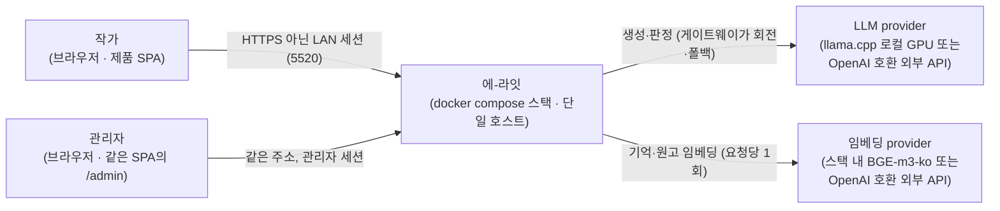
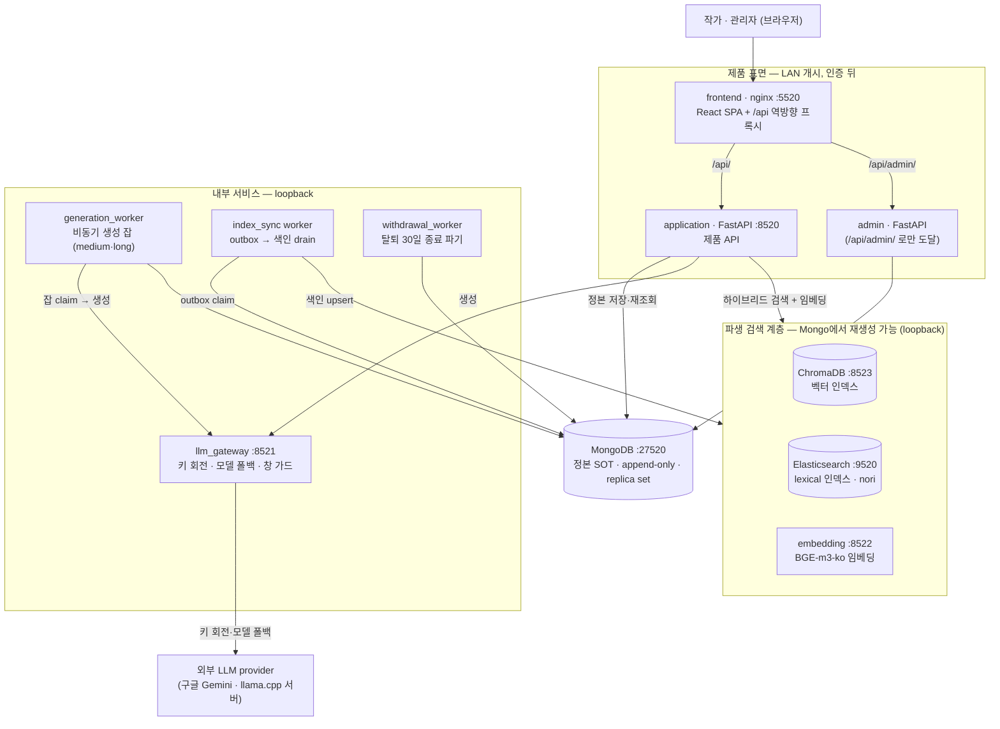
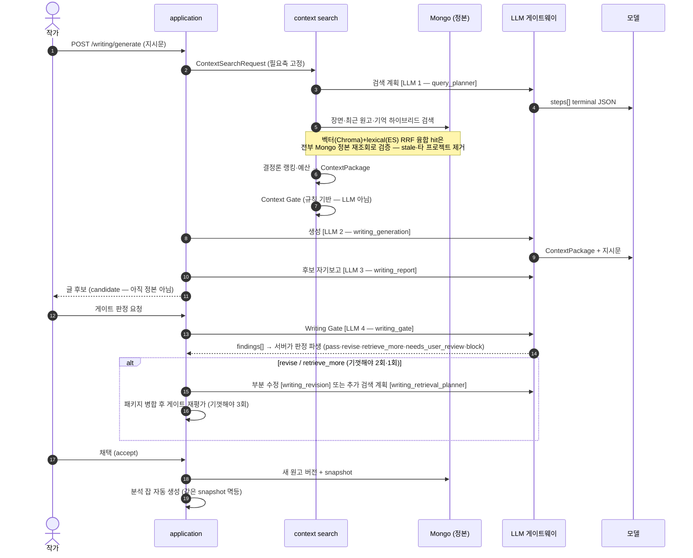
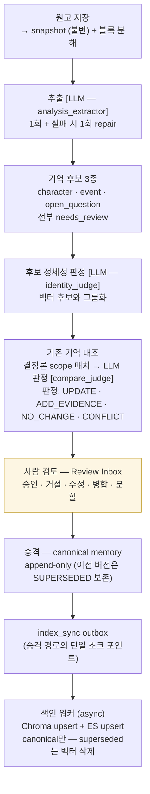

# 아키텍처 (arc42 축약형)

> **이 문서는 눈에 보이는 지도다.** 계약의 정본은 [`system-contract-sot.md`](system-contract-sot.md)
> (v1.8.68), 결정의 근거는 [`plans/`](plans/README.md)에 있다 — 여기는 그 둘을 그림으로
> 되짚는 진입 문서이며, 코드·compose 파일에서 확인한 사실만 담는다(기준 시점 **2026-09-13**).
> 형식은 [arc42](https://arc42.org)의 필수 뷰 — 컨텍스트(§3) · 컨테이너(§4) · 런타임(§5) ·
> 배포(§6) — 를 이 저장소 규모에 맞게 축약했다.

## 1. 시스템 범위와 목적

에-라잇은 장편 창작의 **일관성** 문제를 푸는 개인 창작 메모리 시스템이다. 원고·설정·세계관을
**장기 기억**으로 축적하고, 글을 쓰는 시점마다 필요한 기억만 근거와 함께 검색해 LLM에 제공한다.
생성 모델이 아니라 **기억과 그 검증**이 시스템의 중심이다 — 생성은 마지막 한 단계다.

## 2. 아키텍처를 결정한 제약

| 제약 | 결과 |
|---|---|
| 로컬 1인 운영(dogfood 직전) | docker compose 단일 호스트, 전용 포트 대역 repo 고정 |
| 저장소 무인증 | 저장소·내부 서비스는 `127.0.0.1` 바인드로 **노출면을 없앰**(D8-7 G1=C, SoT v1.7.75) — 자격증명이 아니라 노출 제거 |
| LLM·임베딩 벤더 교체 가능 | 모든 모델 호출이 **게이트웨이 뒤**에서 교체(llama.cpp 로컬 ↔ OpenAI 호환 외부 API, 키 회전·모델 폴백) |
| AI 출력은 정본이 아님 | 생성·분석 결과는 전부 candidate → 사람 검토 → 승격. 기억은 append-only |
| 검색 결과는 진실이 아님 | 파생 인덱스(Chroma·ES) hit은 반드시 **Mongo 정본을 재조회**해 검증된 뒤 ContextPackage가 됨 |

## 3. 컨텍스트 뷰 — 시스템 경계

LAN에 열리는 것은 인증 뒤의 제품 표면(frontend 5520 · application 8520)뿐이고, 모델 서버
(llama override의 9080)는 내용이 아닌 연산을 제공한다. 나머지 전부은 loopback이다(§6).

## 4. 컨테이너 뷰 — 무엇이 어디에 붙어 있나

**저장소 위계가 핵심이다.** MongoDB가 정본(SOT)이고 Chroma·ES는 **언제나 Mongo에서 재생성
가능한 파생 인덱스**다. 파생 인덱스의 hit은 그대로 쓰이지 않고 Mongo 정본 재조회(version·
content_hash·상태 확인)를 통과해야 AI에게 전달된다.

## 5. 런타임 뷰 — 시나리오 3개

### 5-1. 이어쓰기 — 글 한 번 쓰는 동안 벌어지는 일

**왜 이렇게 도는가.** 생성 품질 문제의 상당수는 모델이 아니라 **컨텍스트**에서 온다 — 그래서
컨텍스트를 조립하는 절반 이상이 LLM이 아니라 결정론 규칙(SOT 재조회·게이트·예산)이다. 루프는
**bounded**다(수정 2회·추가 검색 1회·게이트 3회) — 무한 반복은 예산이 아니라 버그라는 판단에서다.

### 5-2. 기억이 쌓이는 흐름 — 추출부터 색인까지

**사람이 닫는다.** 어떤 경로로도 사람 검토 없이는 canonical이 되지 않는다(임계 기반 자동
승격은 별도 env 승인 하에만). "AI가 쓴 것이 곧 사실"이 되는 순간 기억이 오염되고 그 오염이
다음 생성의 입력이 되어 복리로 커지기 때문이다.

### 5-3. 비동기 생성 — medium·long 프리셋

출력이 긴 요청(medium·long)은 동기 경로를 돌지 않는다. `202 + 잡`으로 바뀌고
generation_worker가 Mongo에서 잡을 원자적으로 claim해 §5-1과 같은 파이프라인을 수행한다.
실패는 8종 taxonomy(`INVALID_REQUEST … INTERNAL`)로 분류되고 2회까지 60초 냉각 재시도된다.
**과금은 성공 시에만** 일어난다.

## 6. 배포 뷰 — 포트와 노출 경계

| 서비스 | 포트 | 바인드 | 노출 의도 |
|---|---|---|---|
| frontend | 5520 | `0.0.0.0` | **제품 UI** — LAN 개시, 세션 뒤 |
| application | 8520 | `0.0.0.0` | **제품 API** — LAN 개시, 인증 뒤 |
| llama (선택) | 9080 | `0.0.0.0` | 모델 연산 제공(내용 아님) — GPU 없는 머신에 공유 |
| gateway | 8521 | `127.0.0.1` | 내부 |
| embedding | 8522 | `127.0.0.1` | 내부 |
| chroma | 8523 | `127.0.0.1` | 내부 |
| elasticsearch | 9520 | `127.0.0.1` | 내부 |
| mongo | 27520 | `127.0.0.1` | 내부 — 정본 |
| admin | (없음) | — | nginx `/api/admin/` 경로로만 도달 |

이 분류는 취향이 아니라 **오너 결정으로 정본에 박힌 계약**(SoT v1.7.75)이며
[`tests/test_compose_exposure.py`](../tests/test_compose_exposure.py)가 compose 파일을 읽어
강제한다. 배포 변형 3종(base · 전체 외부 API · 임베딩만 외부)은
[`../docker-compose*.yml`](../docker-compose.yml)과 [README의 서비스 축](../README.md#서비스--어떻게-돌리고-지켜보는가)에 있다.

## 7. 횡단 관심사

- **관측** — LLM을 부르는 호출부 **9종**(`LlmCallSite` = 어댑터 수)이 표준 감사 레코드를 남기고
  KPI로 집계된다. 실패한 호출도 센다. 계약은 SoT "LLM 파이프라인 관측(KPI)" 절.
- **인증·소유권** — 공개 API 87 operation 전부가 인증 tier·소유권·에러 선언 전수 가드 아래.
  관리자 표면은 별도 주소로 분리돼 제품 앱에는 관리 라우트가 없다.
- **quota** — 유료 경로는 요청 단위 과금(일 20/주 100 기본, 관리자 정책 행으로 무제한 가능).
  생성 잡은 성공 시에만 과금.
- **프로젝트 격리** — 저장·검색·Gate·tool handler 전 계층에서 `project_id` 강제.

## 8. 결정 기록

이 문서의 모든 그림 뒤에는 결정 브리프가 있다 — [`plans/README.md`](plans/README.md)
(트랙별 인덱스 118건). 특히:
- 검색 계층 전반 — [`plans/04-agentic-search.md`](plans/04-agentic-search.md) 계열
- bounded 루프 예산 — [`benchmarks/2026-07-15/writing_loop_per_stage_ceiling_q4.md`](benchmarks/2026-07-15/writing_loop_per_stage_ceiling_q4.md)(실측에서 유도)
- 노출 경계 — [`plans/auth-d8-7-infra-auth-decisions.md`](plans/auth-d8-7-infra-auth-decisions.md)
- 외부 API 폴백 — [`plans/external-api-fallback-decisions.md`](plans/external-api-fallback-decisions.md)
